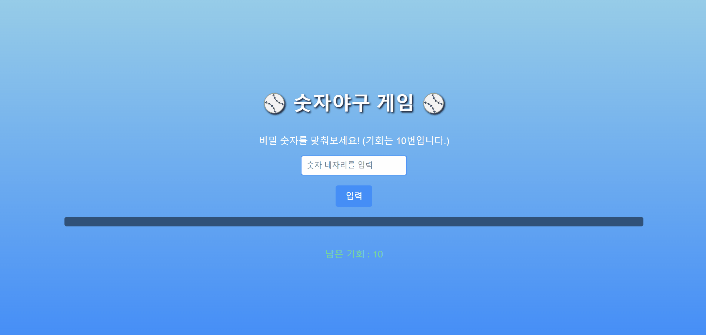

# ⚾ 숫자야구 게임 (Number Baseball Game)
숫자야구 게임은 랜덤으로 생성된 4자리 숫자를 맞추는 간단한 추리 게임입니다. 사용자는 10번의 기회를 사용하여 정답을 맞추거나 실패할 수 있습니다. 성공하거나 실패한 후에는 "새 게임 시작" 버튼을 통해 다시 게임을 즐길 수 있습니다.

### 📃 기능
+ 랜덤 숫자 생성
중복되지 않은 4자리 랜덤 숫자를 생성합니다.
+ 게임 진행
사용자는 숫자 4자리를 입력하여 결과를 확인합니다.
정답과 입력값을 비교해 스트라이크(S)와 볼(B)을 제공합니다.
+ 기회 제한
사용자는 최대 10번의 기회를 가집니다.
기회를 모두 소진하면 정답을 공개하고 게임이 종료됩니다.
+ 새 게임 기능
게임이 종료되면 "새 게임 시작" 버튼으로 게임을 초기화할 수 있습니다.
+ 시각 효과
하늘색, 파란색, 검은색을 조합한 시원한 UI와 간단한 애니메이션 효과를 제공합니다.

<hr>

### 🖥️ 사용 방법
+ 입력
숫자 네 자리를 입력하고 입력 버튼을 클릭하거나 Enter 키를 누릅니다.
+ 결과 확인
스트라이크(S)와 볼(B)을 통해 입력값과 정답의 관계를 알 수 있습니다.
정답을 맞히면 축하 메시지가 표시됩니다.
+ 새 게임
정답을 맞히거나 기회를 모두 사용하면 "새 게임 시작" 버튼을 눌러 새로 시작할 수 있습니다.

<hr>

### 🎨 디자인
+ 색상
하늘색 (#87CEEB): 배경 상단
파란색 (#1E90FF): 배경 하단 및 버튼 강조
검정색 (#000000): 텍스트 그림자
+ 주요 효과
입력 필드 포커스: 파란색 box-shadow 효과.
버튼 호버: 버튼 색이 어두운 파란색으로 변경.
결과 애니메이션: 부드럽게 나타나는 fade-in 효과.

<hr>

### 📂 폴더 구조

number-baseball/
├── number-baseball.html   # 게임의 HTML 구조
├── style.css    # 게임의 시각적 스타일링 (선택 사항)
└── script.js    # 게임의 주요 로직

<hr>

### 🛠️ 기술 스택
+ HTML: 게임의 구조 및 입력 필드, 버튼 등 UI 구성.
+ CSS: 시각적 스타일링과 애니메이션.
+ JavaScript: 랜덤 숫자 생성, 스트라이크/볼 계산, 게임 로직 구현.

<hr>

### 🚀 실행 방법
프로젝트를 로컬에 클론하세요 !
```
코드 복사
git clone https://github.com/your-repo/number-baseball.git
cd number-baseball
index.html 파일을 브라우저에서 열어 게임을 실행합니다.
```
<hr>

### 📷 스크린샷


### 🌟 기능 추가 아이디어
+난이도 선택

쉬움: 3자리 숫자, 기회 15번.
어려움: 5자리 숫자, 기회 8번.
점수 시스템

남은 기회에 따라 점수를 부여.

+ 로컬 스토리지

이전 게임 결과를 저장하여 기록 확인.
